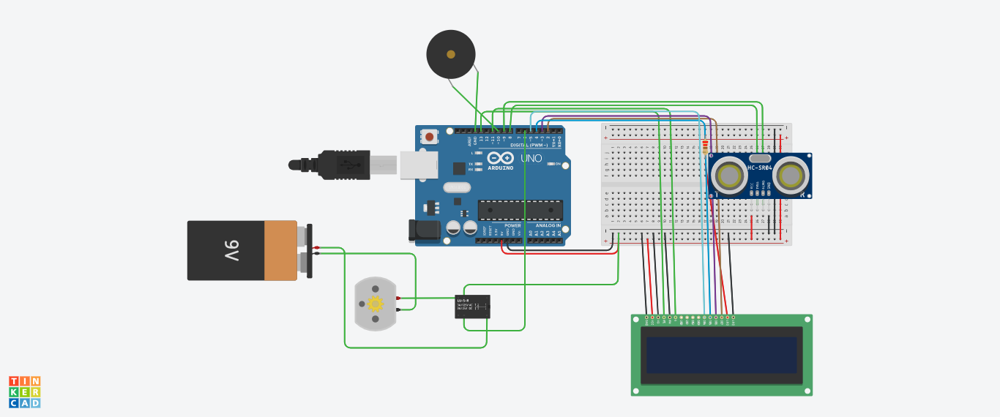

# Automatic Tank Filling System

This system uses an ultrasonic sensor to measure the water level in the water tank and turn on/off the electric smotor accordingly. A turbidity sensor is used to keep a check on containment levels of water.

Read [Abstract.docx](files/abstract.docx) for more info on the working.

## Getting Started

Make sure you have the required hardware components and have installed the latest `Arduino IDE` for dumping the code into the microcontroller.

### Requirments

- Arduino IDE
- Arduino Uno with USB 2.0 CABLE TYPE A/B
- Ultrasonic Sensor(HC-SR04 Sensor)
- LCD(16x2)
- Buzzer
- Submersible 6-12V water pump
- Battery 9V
- Turbidity Sensor
- Relay Module
- Breadboard and Jumper cables

### Circuit Diagram



### Simulation

You can simulate the project before testing [here](https://www.tinkercad.com/things/1Ad4MBFK2Bl-automatic-tank-filling-system)

### Installation

- Clone the repository using 

```bash
git clone https://github.com/VRohit1901/Automatic-Tank-Filling-System.git
```

- Dump the `WaterPump.ino` into the Arduino using the Arduino IDE

- Make the connections as per the circuit diagram

- Power up the Arduino

## Contributing

Contributions are what make the open-source community such an amazing place to learn, inspire, and create. Any contributions you make are **greatly appreciated**.

1. Fork the Project
2. Create your Branch
3. Commit your changes
4. Push to the Branch
5. Open a Pull Request

## License

Distributed under the [GNU General Public License v3.0](https://choosealicense.com/licenses/gpl-3.0/). See `LICENSE` for more information.